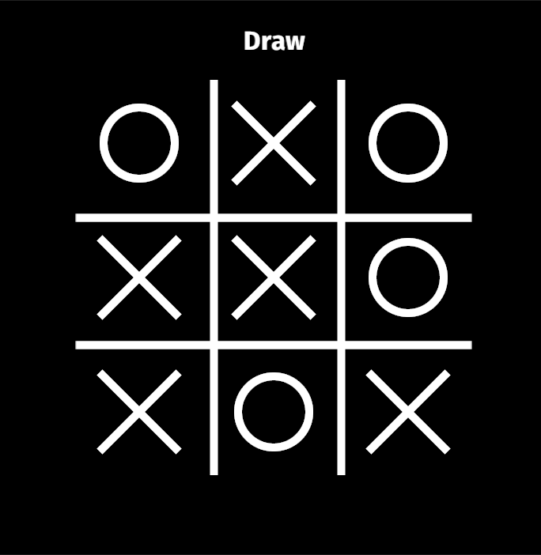

    
    

    

This is a simple Tic-Tac-Toe game project built to **learn** how to use the **Bevy Engine**, a refreshingly and simple data-driven game engine built in Rust. Tic-Tac-Toe is a simple game that is played on a 3x3 grid. The game is played by two players, who take turns marking the spaces in a 3x3 grid. The player who succeeds in placing three of their marks in a horizontal, vertical, or diagonal row is the winner.

---

## How to play
To play it, just press *space* or click on play button on menu to be redirected to board. When at the board, you just need to press **the numpad keys 1-9 to mark the spaces in the grid**. The first player to get three of their marks in a row (up, down, across, or diagonally) is the winner. When all 9 squares are full, the game is over. If no player has 3 marks in a row, the game ends in a tie (draw). To restart the game, press *Esc* to be returned to menu and press *space* or click on play button again.

## TODO
- [ ] add "created with Bevy" logo 
- [ ] add instructions screen
- [ ] add "restart" button
- [ ] improve assets usage to avoid multiple copies of the same asset

---

<strong>Created using:</strong>

    

